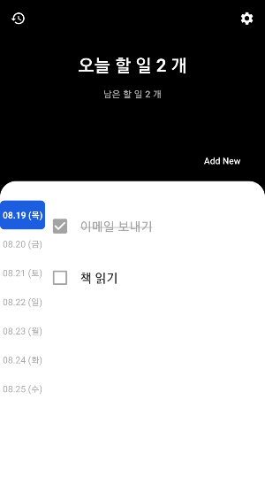
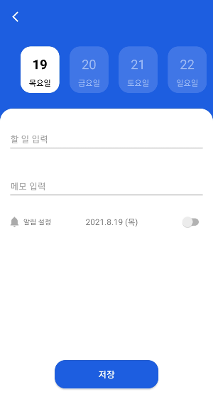
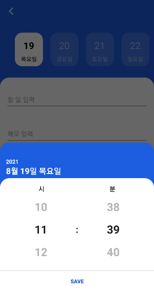
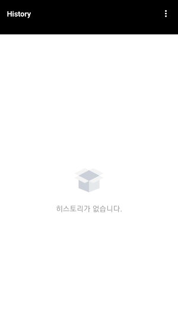
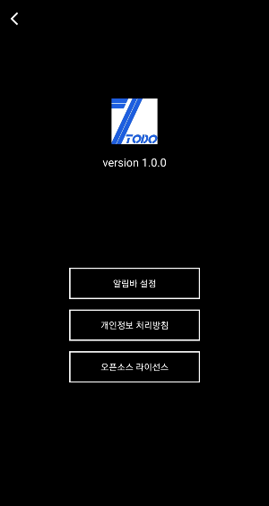

# SimpleToDo

  
  

  

> 일주일의 할 일를 기록하고 알림 및 알림바 설정, 히스토리를 볼 수 있다.

  

## Previews

  

## Architecture

  

## Tech stack & Open-source libraries
- Minimum SDK level 23
- [Kotlin](https://kotlinlang.org/) based, [Coroutines](https://github.com/Kotlin/kotlinx.coroutines)
- [Dagger2](https://dagger.dev/dev-guide/) for dependency injection.
- JetPack
  - Lifecycle - dispose of observing data when lifecycle state changes.
  - ViewModel - UI related data holder, lifecycle aware.
  - Room - local database.
  - Navigation - helps you implement navigation.

- Libraries
  - [Lottie](https://airbnb.io/lottie/#/) - render animation.
  - [licenses](https://developers.google.com/android/guides/opensource) - include open source notices

